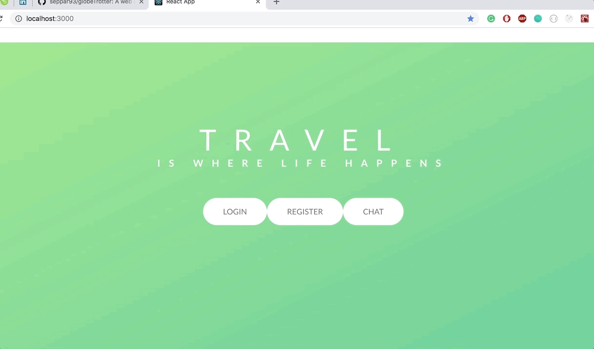

# globeTrotter

A web application to find friends to travel with. Currently in production

## Motivation

In production

## Build status

In production

## Code style

## demonstration

### UI

In production

## Tech/framework used

<b>Built with</b>

- [React](https://reactjs.org/)

## Features

In production

## Code Example

In production

## Installation

In production

## API Reference

In production

## Tests

In production

## How to use?

In production

## Credits

Sepehr
Anum
Johnny
Stephanie
Vidhi

## License

LICENSE(LICENSE)
